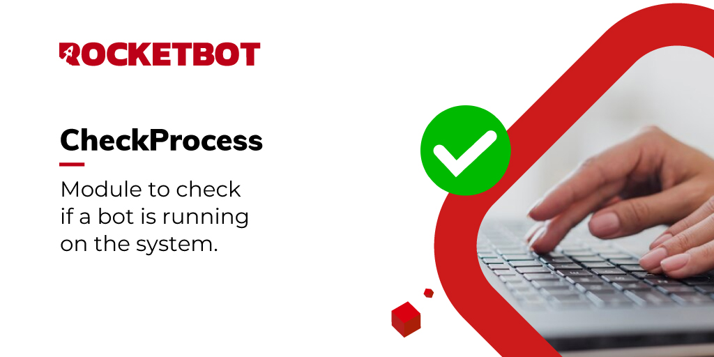

# Check Rocketbot Process
  
With this module you can check if a specific bot is currently running on the system.  

*Read this in other languages: [English](Manual_checkProcess.md), [Português](Manual_checkProcess.pr.md), [Español](Manual_checkProcess.es.md)*
  

## How to install this module
  
To install the module in Rocketbot Studio, it can be done in two ways:
1. Manual: __Download__ the .zip file and unzip it in the modules folder. The folder name must be the same as the module and inside it must have the following files and folders: \__init__.py, package.json, docs, example and libs. If you have the application open, refresh your browser to be able to use the new module.
2. Automatic: When entering Rocketbot Studio on the right margin you will find the **Addons** section, select **Install Mods**, search for the desired module and press install.  

## Description of the commands

### Check Rocketbot process
  
Checks if a Rocketbot process is running
|Parameters|Description|example|
| --- | --- | --- |
|Robot name |Name of the robot you want to search.|name|
|Assign result to variable |Variable where the result will be stored|var|
