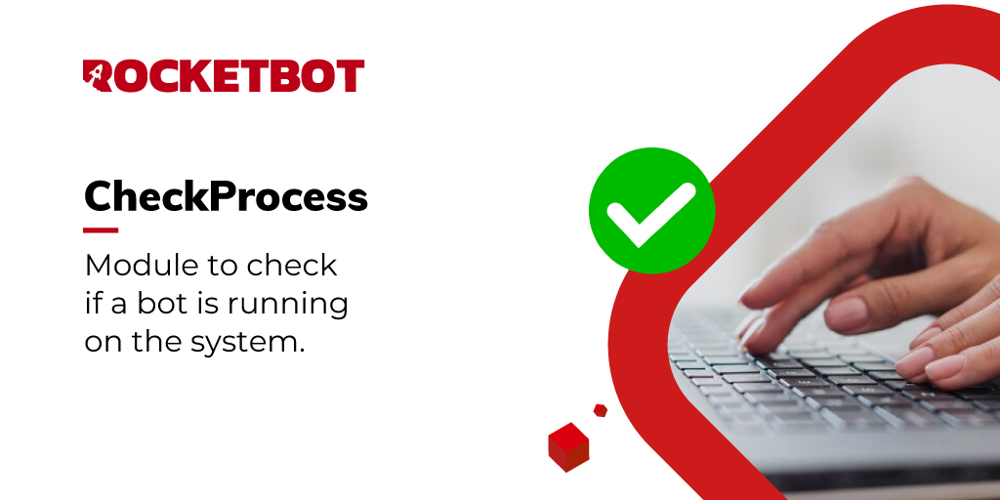

# Verifique Processo do Rocketbot
  
Com este módulo você pode verificar se um bot específico está em execução no sistema.  

*Read this in other languages: [English](Manual_checkProcess.md), [Português](Manual_checkProcess.pr.md), [Español](Manual_checkProcess.es.md)*
  

## Como instalar este módulo
  
Para instalar o módulo no Rocketbot Studio, pode ser feito de duas formas:
1. Manual: __Baixe__ o arquivo .zip e descompacte-o na pasta módulos. O nome da pasta deve ser o mesmo do módulo e dentro dela devem ter os seguintes arquivos e pastas: \__init__.py, package.json, docs, example e libs. Se você tiver o aplicativo aberto, atualize seu navegador para poder usar o novo módulo.
2. Automático: Ao entrar no Rocketbot Studio na margem direita você encontrará a seção **Addons**, selecione **Install Mods**, procure o módulo desejado e aperte instalar.  

## Descrição do comando

### Verificar processo Rocketbot
  
Verifica se está correndo o processo Rocketbot indicado
|Parâmetros|Descrição|exemplo|
| --- | --- | --- |
|Nome do robô|Nome do robô que deseja procurar.|name|
|Atribuir resultado a variável|Variável onde o resultado será armazenado|var|
